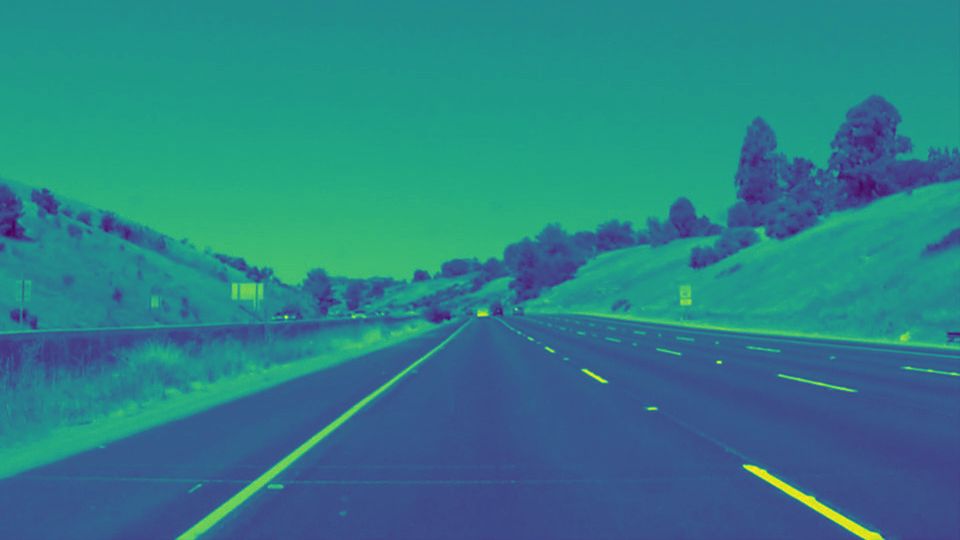

# Writeup Template
**Finding Lane Lines on the Road**

The goals / steps of this project are the following:
* Make a pipeline that finds lane lines on the road
* Reflect on your work in a written report

[//]: # (Image References)

[image1]: ./examples/grayscale.jpg "Grayscale"

---

### Reflection

### 1. Description of pipeline

My pipeline consisted of **5 steps**. 
#### Step 1: Get the dimensions of the image
#### Step 2: Converting the image to grayscale for the canny function

#### Step 3: Define the canny parameters (kernel size, gaussian blur, low/high thresholds)
This step was done iteratively with the aim being to find the best parameters to change 

#### Step 4: Take the vertices for the map, and mask it to take only the lanes on the image
From the image plot, I could identify the points needed to make the lines align with the lane only, so the rest was masked
#### Step 5: Take the high gradient image and Use the weighted_img() function to place the lines on the initial images

##### Draw_Lines() function edit
In order to extrapolate the lane lines, I changed the draw_lines() function by declaring each line boundary.

I then took the main slopes, with it I made a comparative study using conditionals in order to ignore the slopes above/below which the lines shouldn't go.

With this results I appended the boundaries to touch the neighbouring one, thereby closing them with a solid line

### 2. Potential Shortcomings
One potential shortcoming would be what would happen when a slope is very much different from the critical slopes, the algorithm will not be able to adapt to that. Meaning that the pipeline won't work for roads other than these flat and straight ones

### 3. Improvements
We can make this much better by implementing a better system for darker colors, brightness and contrast

